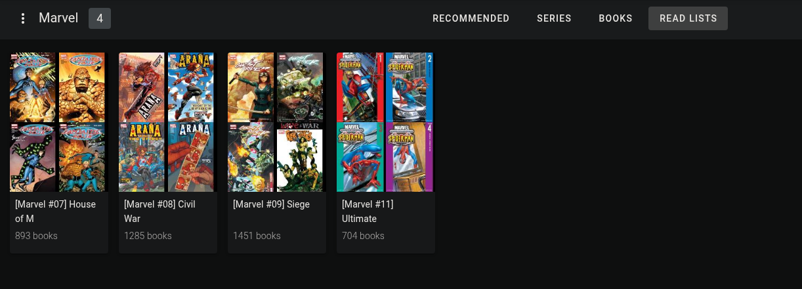
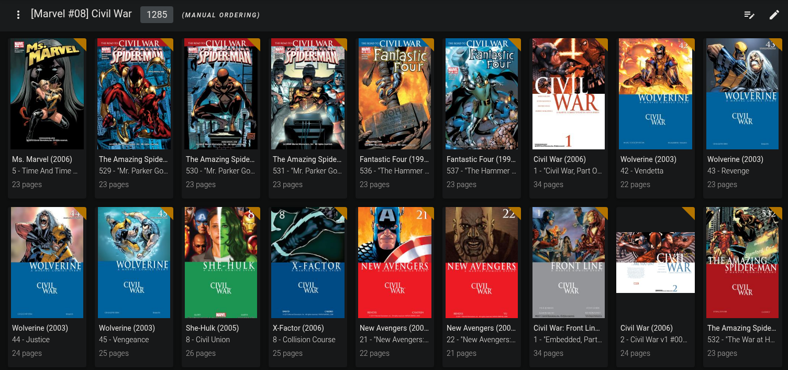
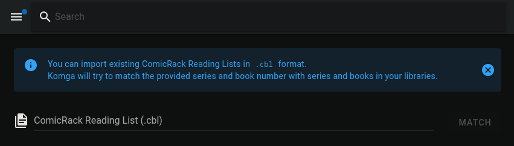
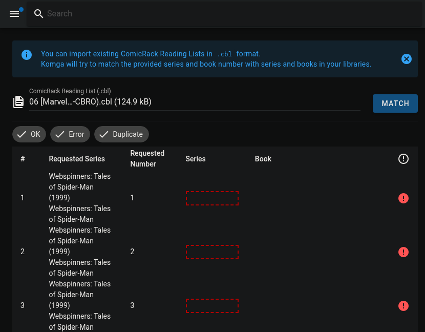

# Korrector
A command I wrote to alter my [Komga](https://github.com/gotson/komga) comics library to more easily to import comic book reading lists from the repository [CBL-ReadingLists](https://github.com/DieselTech/CBL-ReadingLists).

## Usage
```
$ korrector --help
usage: korrector [-h] {copy-share,korrect-komga,korrect-comic-info} ...

Korrector CLI

positional arguments:
    korrect-komga       correct comic information in Komga database
    korrect-comic-info  correct comic information in ComicInfo.xml

options:
  -h, --help            show this help message and exit

$ korrector korrect-komga --help
usage: korrector korrect-komga [-h] [-v] [-b BACKUP] [-d] [--dry-run] [-y] [-r REPLACE] [-o] [db_path]

positional arguments:
  db_path               Path to Komga database file

options:
  -h, --help            show this help message and exit
  -v, --verbose         adds verbose output
  -b, --backup BACKUP   Directory to store database backup
  -d, --korrect-database
                        Adjust the tables in the Komga db to facilitate importing reading lists, not including one-shots
  --dry-run             Perform a dry run without making changes
  -y, --yes             Accept all default prompts
  -r, --replace REPLACE
                        comma separated string of path replacements for use with containerized installations. Ex. you would
                        pass'data,/data/print/comics' if your container mounts /data/print/comics as a volume at /data
  -o, --korrect-oneshots
                        Use db to find one-shots cbz files and correct their ComicInfo.xml.Consider using -r if you are running Komga
                        in a containerized environment.

$ korrector korrect-comic-info --help
usage: korrector korrect-comic-info [-h] [-d] [-v] oneshots

positional arguments:
  oneshots       Path to a dir containing one-shot CBZ files to correct ComicInfo.xml

options:
  -h, --help     show this help message and exit
  -d, --dry-run  Perform a dry run without making changes
  -v, --verbose  adds verbose output


```

# Reading Lists
Komga supports a feature known as reading lists. Reading lists are like playlists, but for your comics

When you begin reading from a list the Komga will queue up each comic for you in sequence as you get done reading them.

This is my reading list called `[Marvel #08] Civil War`, notice there are multiple different series. With this functionality I can read all these issues one right after another without needing to go digging around in my library to find what to read next. And the best part is I was able to 

## Importing a Reading List
Komga allows importing `.cbl` files that will automatically attempt to build a reading list by matching data in the `.cbl` to comics in your library.

This will generate a read list based on the data inside the `.cbl` file. This skips the laborious and time consuming task of adding and organizing each issue by hand.

## DieselTech/CBL-ReadingLists
Personally, I'm following the [Master Marvel Reading Order](https://comicbookreadingorders.com). Thanks to the tireless efforts of the community at the [CBL-ReadingLists](https://github.com/DieselTech/CBL-ReadingLists) repository, this massive list of issues has been organized and translated in a `.cbl` already.

The repository as just about every reading list I could find already implemented in `.cbl` format, so I'd imagine they probably have whatever you're looking for.

# The Problem
Unfortunately, it wasn't as easy as simply importing the `.cbl` files I wanted into my database. I quickly found that most of the issues in the `.cbl` didn't match properly to my library.


# The Solution
Korrector is a command I have developed that will alter your comics and Komga database so that `.cbl` files will match properly with your Komga database.